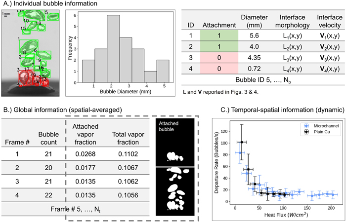
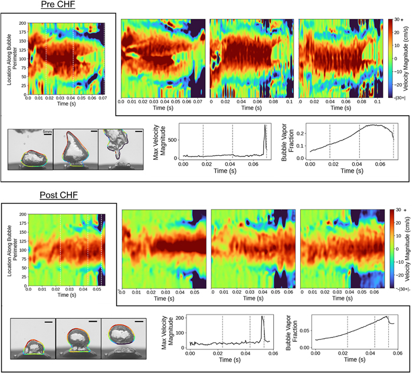

# BubbleID
This framework is made for use in analyzing boiling images. It combines tracking, segmentation, and classification models and is trained on manually labeled pool boiling data. 
It is used for departure classification, velocity interface prediction, bubble statistics extraction.

  

This github is from the work presented here: [**BubbleID:A deep learning framework for bubble interface dynamics analysis**](https://pubs.aip.org/aip/jap/article/136/1/014902/3300686/BubbleID-A-deep-learning-framework-for-bubble)

## Preliminary Setup:
1. Clone this github repo
2. Download the pretrained models [**here**](https://drive.google.com/drive/folders/1eYMW9USX0ZRKDDR8WR__xRAlfMNwCIw7?usp=sharing):
3. Download OCsort Code [**here**](https://github.com/noahcao/OC_SORT/tree/master/trackers/ocsort_tracker)

## How to use
* It is recommended to use the Segmentation_and_Tracking code unless detatchment is important due to the significant increase in computational time. To use this code follow the following guide:
  1. Save boiling video as a .avi file and save each frame as a .jpg in a seperate file
  2. Open the Segmentation_and_Tracking.ipynb file and find the cell with file paths
  3. Update the extension variable to be a string of what you want the data to be saved as (for example: extension ='V1')
  4. Update the directory_path variable to be the string of the path of the images
  5. Update the video_file path to the be the string of the path of the boiling video
  6. Run each cell
* Two files are provided for analyzing the generated data from running these codes.
  1. Plots.ipynb
     This provides codes for generating figures 
  3. Interface_Velocity.ipynb
     This file provides the code for determing and ploting the interface velocity of a single bubble.

  

## Train your own model
You will need generate a yolo dataset. We did this through the use of labelme and converted the generated json files to yolo datasets using the code found here: 
Two files are provided to allow for training both the segmentation and classification model.
1. TrainCNNClassification.ipynb
2. TrainModel.ipynb
