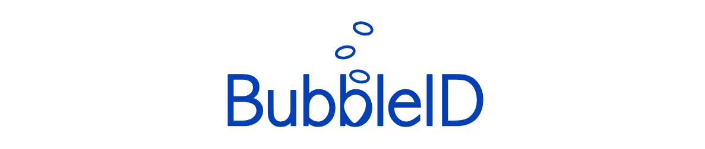
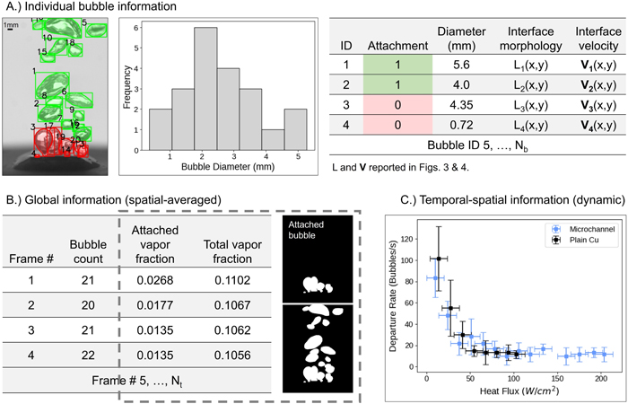
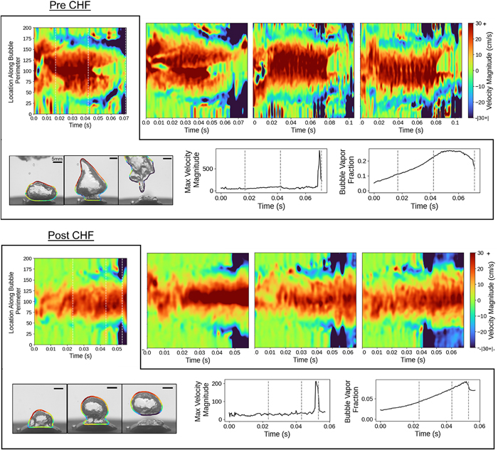

<div align="center">  
  
</div>

[](https://github.com/cldunlap73/BubbleID/tree/v1.0.0)
[](https://github.com/cldunlap73/BubbleID/blob/main/LICENSE)
[](https://pubs.aip.org/aip/jap/article/136/1/014902/3300686/BubbleID-A-deep-learning-framework-for-bubble)

---


This package is for analyzing pool boiling images and is from the paper: [**BubbleID:A deep learning framework for bubble interface dynamics analysis**](https://pubs.aip.org/aip/jap/article/136/1/014902/3300686/BubbleID-A-deep-learning-framework-for-bubble). It combines tracking, segmentation, and classification models and is trained on manually labeled pool boiling data. It is used for departure classification, velocity interface prediction, bubble statistics extraction.

<p align="center">
  
</p>

* This is an updated version of BubbleID for the past version please see [here](https://github.com/cldunlap73/BubbleID/tree/v1.0.0).

## Installation:

* First download and install the latest [Microsoft C++ Build Tools](https://visualstudio.microsoft.com/visual-cpp-build-tools/)
* Create a new enviroment with python 3.10, we used anaconda
* Update dependences:
  ```bash
  pip install --upgrade pip setuptools wheel
  ```
* Install [detectron2](https://github.com/facebookresearch/detectron2):
  ```bash
  pip install git+https://github.com/facebookresearch/detectron2
  ```
* Install Additional Dependencies:
  ```bash
  pip install numpy==1.23 opencv-python filterpy super-gradients
* Install BubbleID:
  ```bash
  pip install bubbleid
  ```

## Using the BubbleID Framework:
The BubbleID framework has pretrained models for our in lab pool boiling images. This section goes over how to use these models to analyze image data. These models may need finetuning with your own data. More on this is provided later. 

|Model|Weights|Description|
|----|-------|----------|
|Instance Segmentation|[Link](https://osf.io/uy2ad)|Model weights for the instance segmentation model.|
|Classification|Link|Model weights for the departure classification model.|

For the model both an avi video and corresponding .jpg images of each frame must be provided.

## Training your own model:
1. Annotate image data, Lableme was used for our dataset.
2. Convert labelme dataset to yolo format
3. Run training
4. See Using the BubbleID Framework but use your new model weights
   
## Tutorials
For convience, tutorials are provided to demonstrate how to use BubbleID to generate your own data. 

## Preliminary Setup:
1. Clone this github repo
2. Download the pretrained models [**here**](https://drive.google.com/drive/folders/1eYMW9USX0ZRKDDR8WR__xRAlfMNwCIw7?usp=sharing):
3. Download OCsort Code [**here**](https://github.com/noahcao/OC_SORT/tree/master/trackers/ocsort_tracker)

## How to use
* It is recommended to use the Segmentation_and_Tracking code unless detatchment is important due to the significant increase in computational time. To use this code:
  1. Save boiling video as a .avi file and save each frame as a .jpg in a seperate file
  2. Open the Segmentation_and_Tracking.ipynb file and find the cell with file paths
  3. Update the extension variable to be a string of what you want the data to be saved as (for example: extension ='V1')
  4. Update the directory_path variable to be the string of the path of the images
  5. Update the video_file path to the be the string of the path of the boiling video
  6. Run each cell
* Two files are provided for analyzing the generated data from running these codes.
  1. Plots.ipynb
     This provides codes for generating figures 
  3. Interface_Velocity.ipynb
     This file provides the code for determing and ploting the interface velocity of a single bubble.


## Train your own model
You will need generate a yolo dataset. We did this through the use of labelme and converted the generated json files to yolo datasets using the code found here: 
Two files are provided to allow for training both the segmentation and classification model.
1. TrainCNNClassification.ipynb
2. TrainModel.ipynb

<p align="center">
  
</p>
