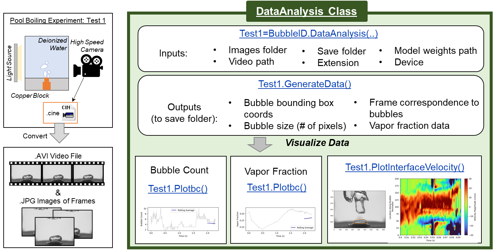

<div align="center">  
  
</div>

[](https://bubbleid.readthedocs.io/en/latest/index.html)
[](https://pypi.org/project/bubbleid/)

[](https://github.com/cldunlap73/BubbleID/tree/v1.0.0)
[](https://github.com/cldunlap73/BubbleID/blob/main/LICENSE)
[](https://osf.io/3nwyx/)
[](https://pubs.aip.org/aip/jap/article/136/1/014902/3300686/BubbleID-A-deep-learning-framework-for-bubble)

---


This package is for analyzing pool boiling images and is from the paper: [**BubbleID:A deep learning framework for bubble interface dynamics analysis**](https://pubs.aip.org/aip/jap/article/136/1/014902/3300686/BubbleID-A-deep-learning-framework-for-bubble). It combines tracking, segmentation, and classification models and is trained on manually labeled pool boiling data. It is used for departure classification, velocity interface prediction, bubble statistics extraction. It is built on ocsort and detectron2. 

<p align="center">
  
</p>

This is an updated version of BubbleID for the past version please see [here](https://github.com/cldunlap73/BubbleID/tree/v1.0.0).

## Installation:

First download and install the latest [Microsoft C++ Build Tools](https://visualstudio.microsoft.com/visual-cpp-build-tools/)

Create a new environment with python 3.10, we used anaconda

Ensure git is installed, we used anaconda:
  ```bash
  conda install anaconda::git
  ```
Update dependencies:
  ```bash
  pip install --upgrade pip setuptools wheel
  ```
Install [pytorch](https://pytorch.org/) (Make sure cuda version matches if using gpu):
  ```bash
  pip3 install torch torchvision torchaudio
  ```
Install [detectron2](https://github.com/facebookresearch/detectron2):
  ```bash
  pip install git+https://github.com/facebookresearch/detectron2
  ```
Install Additional Dependencies:
  ```bash
  pip install numpy==1.23 opencv-python filterpy super-gradients
```
Install BubbleID:
  ```bash
  pip install bubbleid
  ```

## Using the BubbleID Framework:
For in depth description of functions available please view the [read the docs](https://bubbleid.readthedocs.io/en/latest/index.html) page.
<p align="center">
  
</p>

1.  **Data Preperation**: Data from pool boiling experiments must be saved as a video (.AVI) file and individual images (.JPG) for each frame. 
2.  **AnalyzeData Class**: The BubbleID frame work is set up as a class. You first instantiate a class for the experimental data you want. 

    * Define the location of the saved boiling video and images. 
    * Also define the folder you want all the data to be saved in and the extension you want each file to be saved with. 
    * Define the location of the model weights you will be using. The BubbleID framework has pretrained models for our in lab pool boiling images. This section goes over how to use these models to analyze image data. These models may need finetuning with your own data. More on this is provided later.

      |Model|Weights|Description|
      |----|-------|----------|
      |Instance Segmentation|[Link](https://osf.io/uy2ad)|Model weights for the instance segmentation model.|
      |Classification|Link|Model weights for the departure classification model.|
  
    * Define the device you will be running on; either "cpu" or "gpu"
3. **GenerateData Function**: When you call the generate data function multiple files are generated and saved in the defined save folder. Each file will contain the extension set previously. This function must be ran prior to the data visualization functions.
4. **Data Visualization**: There are several functions within the class that can be called to save and display plots of the data generated by the segmentation and tracking models. These include ploting vapor fraction, bubble count, and interface velocity. 

## Tutorials
* For convenience, tutorials are provided in the github to demonstrate how to use BubbleID to generate your own BubbleID results. There are also tutorials zipped with data to ease the process of running them. Both tutorials exist as .py and .ipynb files.
  
  |[Download Steady State Tutorial And Data Zip](https://osf.io/axts7)|
  |--------------------------------------|

  |Download Transient Tutorial and Data Zip|
  |------------------------------------|


## Training your own model:
1. Annotate image data, Lableme was used for our dataset.
2. Convert labelme dataset to yolo format
3. Run training
4. See Using the BubbleID Framework but use your new model weights
   

<p align="center">
  
</p>

